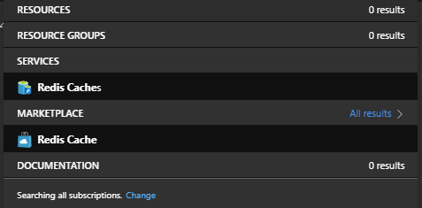
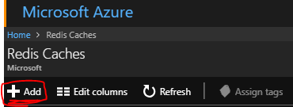
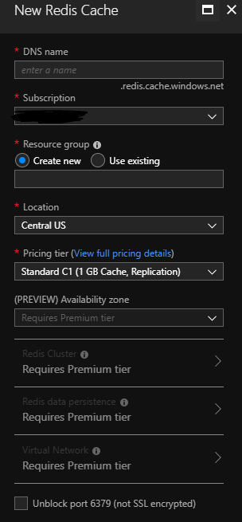
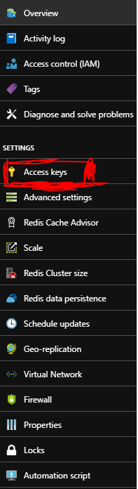

# Celery-Tests

Really simple example to learn celery with Python. This code focus on the deployment and use of Celery with Redis with Azure.

## Creating a Redis Cache on Azure

You can get more information about Redis Cache Azure Services [here](https://docs.microsoft.com/en-us/azure/redis-cache/).

It's really simple to create a Redis Cache with Azure, I'll help you through the steps.

Search for ```Redis Cache``` on Azure and then click on the link below services



After that, you will be redirected to a screen with all the Redis Caches you have created. Then click on Add, at the upper left of the page:



Just insert a unique DNS name on the first field, choose between creating a new resource group or use a existing one, choose pricing and click create.
The creating of the resource will take some time.



## Conecting Celery with the Azure Redis Cache

It's also really simple to connect Celery with the Redis created on Azure, but there are some trick things. I'll explain each step in order to
help you trough the whole process.
After creating the resource (as I explained on the steps before), go to it and click on the Acess Keys link:



After getting this key, you'll be able to connect to celery like this (on the ```celery_config.py``` file):

``` python
adress = 'redis://:{password}@{name_of_cache}.redis.cache.windows.net:6379/0'
app = Celery('celery_config', broker=adress, include=['celery_blog'])
```

Where ```password``` is the primary key we got on the previous step and ```name_of_cache``` is the dns name you put when creating. This
is also the name of the resource, when you search for it, so It's really easy to find it.

## Explaining code and running it

This is a really simple code example I did following this [blog post](https://www.agiliq.com/blog/2015/07/getting-started-with-celery-and-redis/). Each piece
of code is explained with great detail on this post. You can get the instrucitons to run it reading the blog too. The only thing I tried to make easier, is installing
dependencies. All the packages you need are inside ```requirements.txt``` file, and you can easily install running the command

``` shell
pip install -r requirements.txt
```

After that, you'll be able to run all the commmands on the blog post with a Redis Cache on Azure.